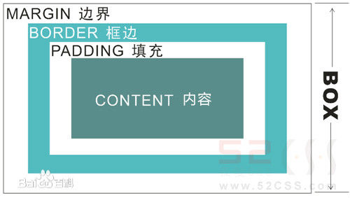

## 学习css页面布局
#### [1 基础](#base)
#### [2 样式布局](#style)
#### <a name='base'>1.基础</a>
**子选择器：**
.food>li{border:1px solid red;}
只选择food的一级子标签li而对其孙子没有影响

**包含（后代）选择器：**.food li{}food 下面的所有li标签

**伪类选择器：** a:hover{}

**分组选择符：** h1,h2{}

**css样式优先级：** 可以从层叠的角度来看，即后面的覆盖前面的样式

**权重：** 标签：1 类：10 id：100

**重要性：**
```
p{
    color:red!important;
    font-size:10px!important;
}
```
可以让该样式具有最高权值

**字体：**

italic：斜体

下划线和删除线：
```
a {
    text-decoration:underline;
    text-decoration:line-through;
}
```

段落缩进：
```
p{
    text-indent:2em;//2em就是字体的两倍大小
}
```

字体之间的间距：
```
h1{
    letter-spacing:50px;//中英文单个文字之间的间距
    word-spacing:50px;//英文单词之间的间距
}
```

**元素分类：**

[点此查看元素含义](http://www.w3school.com.cn/tags/tag_dl.asp)

块级元素：
```
<div>、<p>、<h1>...<h6>、<ul>、<ol>、<dl>、<table>、<address>、<blockquote>、<form>
```

特点：
<ol>
    <li>每个元素独占一行</li>
    <li>相当于一个盒子</li>
    <li>宽度默认为父元素的100%</li>
</ol>


内联(行内)元素：
```
<a>、<span>、<br>、<i>、<em>、<strong>、<label>、<q>、<var>、<cite>、<code>
```

特点：
<ol>
    <li>和其他元素在同一行</li>
    <li>不可设置宽高及上下margin</li>
    <li>宽度默认为包含内容的宽度</li>
</ol>


内联块状元素：
```
、<input>
```

特点：
<ol>
    <li>和其他元素在同一行</li>
    <li>相当于一个盒子</li>
</ol>


**盒子模型：**



**层模型：**

三种形式：
<ol>
    <li>绝对定位(position: absolute)
    <p>如果想为元素设置层模型中的绝对定位，需要设置position:absolute(表示绝对定位)，
    这条语句的作用将元素从文档流中拖出来，然后使用left、right、top、bottom属性相对于
    其最接近的一个具有定位属性(position:relative)的父包含块进行绝对定位。如果不存在
    这样的包含块，则相对于body元素，即相对于浏览器窗口。</p>
    </li>
    <li>相对定位(position: relative)</li>
    <li>固定定位(position: fixed)</li>
</ol>

#### <a name="style">2.样式布局</a>

